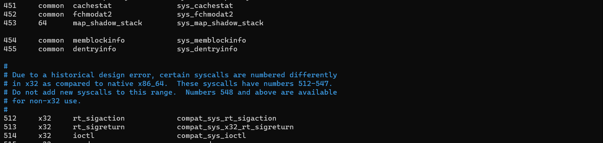
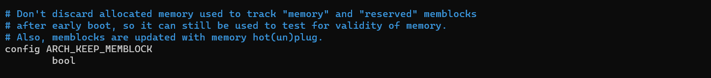
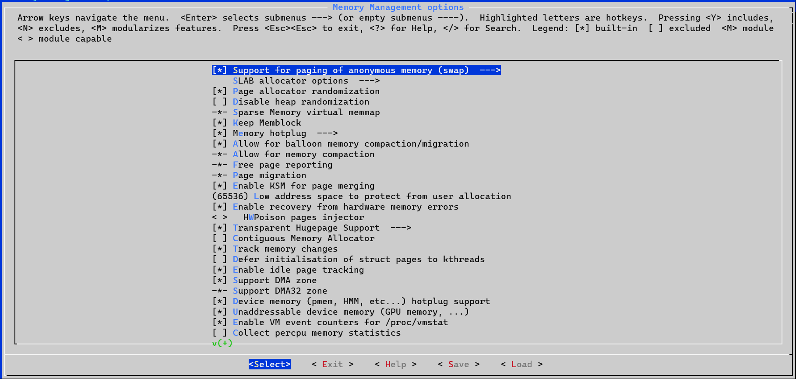
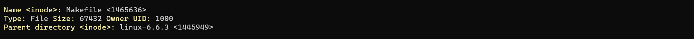

## Инструменты для сборки.
Выполняется на виртуальной машине с Ubuntu.

Перед началом работ устанавливаем необходимые инструменты.
```
sudo apt update && sudo apt upgrade -y 
sudo apt install build-essential libncurses-dev libssl-dev libelf-dev bison flex -y
```
Создаем в домашней директории каталог *kernel* и заходим в него.
```
mkdir kernel 
cd kernel
```
Скачиваем и распаковываем последний дистрибутив ядра Linux.
```
wget -P https://cdn.kernel.org/pub/linux/kernel/v6.x/linux-6.6.3.tar.xz \
tar -xvf linux-6.6.3.tar.xz
```
Заходим в созданную папку и создаем папку для новых syscall вызовов 
```
cd linux-6.6.3 
mkdir mysyscalls
```
Добавляем нашу папку в список папок дистрибутива Linux. 
Открываем в редакторе файл Kbuild и добавляем строку 
```
obj-y += mysyscalls/
```

## Создание syscall
### memblock
Заходим в папку *mysyscalls* и создаем файлы *memblockinfo.h и memblockinfo.с*
```
/***********************************************
*  
* MEMBLOCKINFO.H
*
************************************************/

#ifndef _MEMBLOCKDATA_H_
#define _MEMBLOCKDATA_H_

enum memblockinfo_flags {
	MEMBLOCKINFO_NONE		= 0x0,	/* No special request */
	MEMBLOCKINFO_HOTPLUG	= 0x1,	/* hotpluggable region */
	MEMBLOCKINFO_MIRROR		= 0x2,	/* mirrored region */
	MEMBLOCKINFO_NOMAP		= 0x4,	/* don't add to kernel direct mapping */
	MEMBLOCKINFO_DRIVER_MANAGED = 0x8	/* always detected via a driver */
};

struct memblockinfo_region {
	long long unsigned base;
	long long unsigned size;
	enum memblockinfo_flags flags;
};

struct memblockinfo_type {
	unsigned long cnt;
	unsigned long max;
	long long unsigned total_size;
	struct memblockinfo_region regions[128];
	char name[32];
};

struct memblockinfo {
    bool bottom_up;  /* is bottom up direction? */
	long long unsigned current_limit;
	struct memblockinfo_type memory;
	struct memblockinfo_type reserved;
};

#endif
```
```
/***********************************************
*  
* MEMBLOCKINFO.C
*
************************************************/

#include <linux/kernel.h>
#include <linux/syscalls.h>
#include <linux/string.h>
#include <linux/memblock.h>
#include "memblockinfo.h"

static struct memblockinfo memblockinfo;

SYSCALL_DEFINE2(memblockinfo, void __user *, buffer, unsigned long, len)
{
    if(len < sizeof(struct memblockinfo))
        return -EINVAL;

        
    // ---------- copy memblock ---------------
    memblockinfo.bottom_up = memblock.bottom_up;
    memblockinfo.current_limit = memblock.current_limit;

    memblockinfo.memory.cnt = memblock.memory.cnt;
    memblockinfo.memory.max = memblock.memory.max;
    memblockinfo.memory.total_size = memblock.memory.total_size;
    strcpy(memblockinfo.memory.name, memblock.memory.name);

    memblockinfo.reserved.cnt = memblock.reserved.cnt;
    memblockinfo.reserved.max = memblock.reserved.max;
    memblockinfo.reserved.total_size = memblock.reserved.total_size;
    strcpy(memblockinfo.reserved.name, memblock.reserved.name);

    struct memblock_region* region = NULL;
    int i = 0;
    for_each_mem_region(region) {
        memblockinfo.memory.regions[i].flags = (enum memblockinfo_flags)region->flags;
        memblockinfo.memory.regions[i].base = region->base;
        memblockinfo.memory.regions[i].size = region->size;
        i++;
    }

    i = 0;
    for_each_reserved_mem_region(region) {
        memblockinfo.reserved.regions[i].flags = (enum memblockinfo_flags)region->flags;
        memblockinfo.reserved.regions[i].base = region->base;
        memblockinfo.reserved.regions[i].size = region->size;
        i++;
    }

    if (copy_to_user(buffer, &memblockinfo, sizeof(memblockinfo)))
        return -EFAULT;
    
    return 0;
}
```
### dentry
Заходим в папку *mysyscalls* и создаем файлы *dentryinfo.h и dentryinfo.с*
```
/******************************************
 * 
 * DENTRYINFO.H
 * 
******************************************/

#ifndef _DENTRYINFO_H_
#define _DENTRYINFO_H_

#define DENTRYINFO_NAME_SIZE 32

struct dentryinfo {
    bool is_directory;
    unsigned int owner;
    long long size;
    char name[DENTRYINFO_NAME_SIZE];
    unsigned long i_inode;
    char folder_name[DENTRYINFO_NAME_SIZE];
    unsigned long folder_i_inode;

    int children_cnt;
    char children[128][DENTRYINFO_NAME_SIZE];
};

#endif
```
```
/***************************
* 
*   DENTRYINFO.C
*
*****************************/

#include <linux/kernel.h>
#include <linux/syscalls.h>
#include <linux/string.h>
#include <linux/path.h>
#include <linux/dcache.h>
#include <linux/namei.h>
#include "dentryinfo.h"

static struct dentryinfo dentryinfo;

SYSCALL_DEFINE3(dentryinfo, const char __user *, filename, void __user *, buffer, unsigned long, len) {
    if(len < sizeof(struct dentryinfo))
        return -EINVAL;

    struct file * fi;
    struct dentry * thedentry;
    struct dentry * parentdentry;
    struct dentry * curdentry;
    const char * curname = NULL;

    struct filename *fname = getname(filename);
    if(!fname) {
        pr_err("Can't read path file\n");
        return -EINVAL;           
    }

    fi = filp_open(fname->name, O_RDONLY, 0);
    if(!fi) {
        pr_err("Can't open file: %s\n", fname->name);
        return -EINVAL;          
    }

    thedentry = fi->f_path.dentry;
    parentdentry = thedentry->d_parent;

    dentryinfo.is_directory = S_ISDIR(thedentry->d_inode->i_mode);
    strncpy(dentryinfo.name, thedentry->d_name.name, DENTRYINFO_NAME_SIZE);
    dentryinfo.i_inode = thedentry->d_inode->i_ino;
    dentryinfo.owner = thedentry->d_inode->i_uid.val;
    dentryinfo.size = thedentry->d_inode->i_size;
 
    strncpy(dentryinfo.folder_name, parentdentry->d_name.name, DENTRYINFO_NAME_SIZE);
    dentryinfo.folder_i_inode = parentdentry->d_inode->i_ino;

    dentryinfo.children_cnt = 0;
    list_for_each_entry(curdentry, &thedentry->d_subdirs, d_child) {
        struct inode* inode = d_inode(curdentry);
        if ( !inode || !S_ISDIR(inode->i_mode)) 
            continue;

        curname = curdentry->d_name.name;
        pr_info("child: %s", curname);
        strncpy(dentryinfo.children[dentryinfo.children_cnt], curname, DENTRYINFO_NAME_SIZE);   
        
        if(dentryinfo.children_cnt == 127) 
            break;
        dentryinfo.children_cnt++;
    }

    filp_close(fi, NULL);
    if (copy_to_user(buffer, &dentryinfo, len))
        return -EFAULT;

    return 0;
}
```
Для сборки модулей в *mysyscalls* и создаем *Makefile*
```
# MAKEFILE

obj-y := memblockinfo.o dentryinfo.o
```
## Регистрация syscall
Переходим в папку с дистрибутивом Linux *~/kernel/linux-6.6.3* и
открываем на редактирование файл *./include/linux/syscalls.h*. В конце файла добавляем строки:
```
asmlinkage long sys_memblockinfo(void __user *buffer, unsigned long len);
asmlinkage long sys_dentryinfo(const char __user *filename, void __user *buffer, unsigned long len);
```
Открываем на редактирование файл *./arch/x86/entry/syscalls/syscall_64.tbl*.
Находим номер в таблице системных вызовов номер последнего syscall и добавляем свою запись со следующими номерами 454 и 455.


## Конфигурация и сборка ядра Linux
Переходим в папку с дистрибутивом Linux *~/kernel/linux-6.6.3*

Копируем текущую конфигурацию Linux
```
cp -v /boot/config-$(uname -r) .config
```
Так как структура **memblock** уничтожается после начальной стадии загрузки Linux, 
для ее сохранения необходимо включить флаг CONFIG_ARCH_KEEP_MEMBLOCK. 

Для этого редактируем файл с флагами *./mm/Kconfig*.
Открываем файл на редактирование, находим запись

и меняем на
```
config ARCH_KEEP_MEMBLOCK
   bool 'Keep Memblock'
```
В папке *linux-6.6.3* запускаем команду
> make menuconfig

Соглашаемся с генерацией новых записей
и после появления графического окна переходим в пункт *Memory Management options*, устанвливаем флаг в пункте *Keep Memblock*,
сохраняемся и выходим.


Чтобы подавить ошибки сборки ядра на Ubuntu дополнительно выполняем следующие команды
```
scripts/config --disable SYSTEM_TRUSTED_KEYS 
scripts/config --disable SYSTEM_REVOCATION_KEYS
```
После завершения конфигурирования запускаем сборку ядра.
```
make -j$(nproc)
```
После завершения сборки устанавливаем модули и ядро Linux, после чего перезагружаем виртуальную машину.
```
sudo make modules_install
sudo make install
sudo reboot now
```
После перезагрузки проверяем версию Linux
```
uname -mrs
```
На экране должна появиться информация *Linux 6.6.3 x86_64*

## Вызов syscall из приложений
Копируем новые заголовочные файлы в общедоступный каталог
```
sudo cp ~/kernel/linux-6.6.3/mysyscall/memblockinfo.h /usr/include/linux
sudo cp ~/kernel/linux-6.6.3/mysyscall/dentryinfo.h /usr/include/linux
```
В домашнем каталоге создаем папку sc_test. 
### memblock
Cоздаем файл *memblocktest.c*
```
/*****************************************************
*
* MEMBLOCKTEST.C
*
*****************************************************/

#include <stdbool.h>
#include <linux/kernel.h>
#include <linux/memblockinfo.h>
#include <sys/syscall.h>
#include <stdio.h>
#include <unistd.h>
#include <string.h>
#include <errno.h>

#define __NR_memblockinfo 454

long memblockinfo_syscall(struct memblockinfo* buffer, unsigned long len)
{
    return syscall(__NR_memblockinfo, buffer, len);
}

static void print_memblockinfo_type(struct memblockinfo_type* memtype) {
    printf("\n");
    printf("Name: %s\n", memtype->name);
    printf("Number of regions: %ld\n", memtype->cnt);
    printf("Size of the allocated array: %ld\n", memtype->max);
    printf("Size of all regions: %llu\n", memtype->total_size);


    printf("base\t\tsize\t\tflag\n");
    printf("----------------------------------------------------\n");
    
    struct memblockinfo_region* region = NULL;
    for (region = memtype->regions;
	     region < (memtype->regions +memtype->cnt);
	     region++) {

        char* flags = 
            region->flags == MEMBLOCKINFO_NONE
            ? "MEMBLOCK_NONE" :
            region->flags == MEMBLOCKINFO_HOTPLUG
            ? "MEMBLOCK_HOTPLUG" :
            region->flags == MEMBLOCKINFO_MIRROR
            ? "MEMBLOCK_MIRROR" :
            region->flags == MEMBLOCKINFO_NOMAP
            ? "MEMBLOCK_NOMAP" :
            region->flags == MEMBLOCKINFO_DRIVER_MANAGED
            ? "MEMBLOCK_DRIVER_MANAGED" :
            "NO FLAGS";

        printf(
            "%12llu\t%12llu\t%s\n",
            region->base,
            region->size,
            flags);
    }
} 

void print_memblockinfo(struct memblockinfo* memblock) {
    printf(">>> Struct MEMBLOCK information <<<\n\n");

    printf("Bottom Up: %s\n", memblock->bottom_up ? "TRUE" : "FALSE");
    printf("Current limit: %llu\n", memblock->current_limit);

    print_memblockinfo_type(&memblock->memory);
    print_memblockinfo_type(&memblock->reserved);
}

int main(int argc, char *argv[])
{
    struct memblockinfo memblock;

    long rc;
    rc = memblockinfo_syscall(&memblock, sizeof(memblock));

    if(rc < 0) {
        perror("System call is failed");
        return 1;
    }

    print_memblockinfo(&memblock);
    return 0;
}
```
Компилируем файл и запускаем на исполнение
```
gcc -o memblocktest memblocktest.c 
./memblocktest
```
На экран выводится информация о структуре memblock

### dentry
Cоздаем файл *dentrytest.c*
```
/******************************************
 * 
 * DENTRYTEST.C
 * 
******************************************/
#include <stdbool.h>
#include <linux/kernel.h>
#include <sys/syscall.h>
#include <stdio.h>
#include <unistd.h>
#include <string.h>
#include <errno.h>
#include <linux/dentryinfo.h>
#include <linux/types.h>

#define CLR "\033[33;1m" // yellow
#define ECLR "\033[0m" // end of color string

#define __NR_dentryinfo 455

long dentryinfo_syscall(char* filename, struct dentryinfo* buffer, unsigned long len)
{
    return syscall(__NR_dentryinfo, filename, buffer, len);
}

void dentryinfo_print(struct dentryinfo *info) {
    printf("\n");

    printf(CLR"Name <inode>:"ECLR" %s <%lu>\n", info->name, info->i_inode);
    
    printf(CLR"Type:"ECLR" %s ", info->is_directory ? "Directory" : "File");
    printf(CLR"Size:"ECLR" %llu ", info->size);
    printf(CLR"Owner UID:"ECLR" %u\n", info->owner);

    printf(CLR"Parent directory <inode>:"ECLR" %s <%lu>\n", info->folder_name, info->folder_i_inode);

    if (info->is_directory) {
        printf(CLR"\nChildren:\n"ECLR);
        for(int i = 0; i < info->children_cnt; i++) {
            printf("%s ", info->children[i]);
        }
        printf("\n");
    }
    printf("\n");
};

int main(int argc, char *argv[])
{
    if(argc < 2) {
        printf("Usage:  dentrytest [filename | dirname]\n");
        return -1;
    }

    char* filename = argv[1];

    if (access(filename, F_OK) != 0) {
        printf("No such file or directory\n");
        return 1;
    }

    struct dentryinfo info;

    long rc;
    rc = dentryinfo_syscall(filename, &info, sizeof(info));

    if(rc < 0) {
        perror("System call is failed");
        return 1;
    }

    dentryinfo_print(&info);
    return 0;
}
```
Компилируем файл и запускаем на исполнение, выбрав в качестве тестируемого файла корневую папку
```
gcc -o dentrytest dentrytest.c 
./dentrytest ~/kernel/linux-6.6.3/
./dentrytest ~/kernel/linux-6.6.3/Makefile
```
На экран выводится информация о выбранной папке или файле



